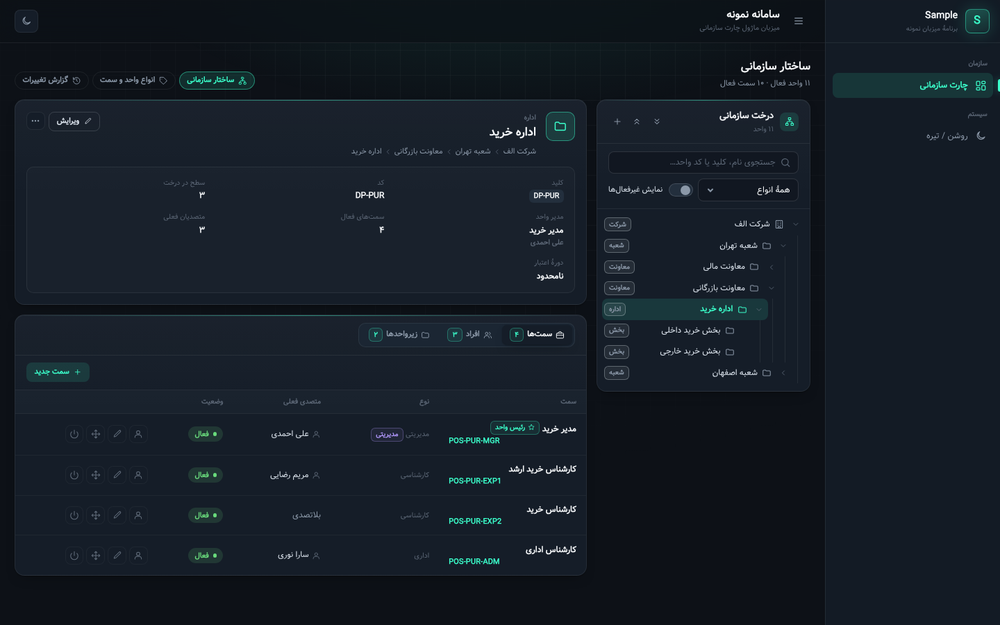

# OrgChart

Reusable organizational chart module for ASP.NET Core (.NET 9, EF Core 9, SQL Server).

It stores only the **structure** of an organization: a tree of org units, positions in those units,
and which user holds which position over time. Other modules (for example the Acl access-control
module) read it through interfaces and refer to units and positions by **stable string keys** that
never change when the chart is restructured.

## Projects

| Project | Purpose |
|---|---|
| `OrgChart.Core` | Domain model and abstractions. No ASP.NET Core or EF Core dependency. |
| `OrgChart.EFCore` | `OrgChartDbContext` (schema `org`), migrations. |
| `OrgChart.AspNetCore` | Current user from the HTTP request (`AddHttpContextUser()`). |
| `OrgChart.Razor` | Persian/RTL admin pages under `/OrgChart` on the MX design system (`AddAdminUi()`). |
| `OrgChart.Acl` | Bridge to the [Acl](https://github.com/AliRezaMohtaram/Acl) module (`AddAcl()`). |

## Host setup

```csharp
builder.Services.AddRazorPages();
builder.Services.AddOrgChart()
    .AddSqlServerStore(connectionString)      // schema "org"
    .AddHttpContextUser()                     // who made each change (audit log)
    .AddUserDirectory<MyUserDirectory>()      // names and user search in the admin pages
    .AddAdminUi(ui =>
    {
        ui.EditPolicy = p => p.RequireRole("OrgAdmin");   // default: any signed-in user
        // ui.UseStandaloneLayout();                       // host without the MX layout
    });
// ...
app.UseAuthentication();
app.UseAuthorization();
app.MapRazorPages();
```

By default the pages render in the host's `_Layout`, which must load the MX design system (`mx.css`, `mx.js`).

`samples/OrgChart.Sample.Web` runs on SQLite with demo data (`dotnet run`, then open `/OrgChart`).



## With Acl

```csharp
builder.Services.AddOrgChart().AddSqlServerStore(cs).AddAcl();          // OrgChart.Acl
builder.Services.AddAccessControl(o => o.ApplicationKey = "MyApp").AddSqlServerStore(cs);
```

Acl then reads positions from the chart (delegations and deputies included, limited to the delegated roles), chart
changes refresh Acl's cached access, and the delegation forms offer the Acl roles bound to the position.

`OrgChart.Acl` needs the Acl packages (0.2.0+). Until they are on a shared feed, it restores them from
`../Acl/artifacts/packages` (an Acl clone next to this repository, after `dotnet pack Acl.sln -c Release`); point the
`AclPackages` property or environment variable elsewhere if needed.

## Database

- `db/orgchart-schema.sql` — idempotent SQL Server DDL generated from the migrations.
- `db/orgchart-drop.sql` — removes the `org` schema from the current database.

## Build & test

```
dotnet build
dotnet test
```

The whole solution includes `OrgChart.Acl`, so pack Acl first (see above).
